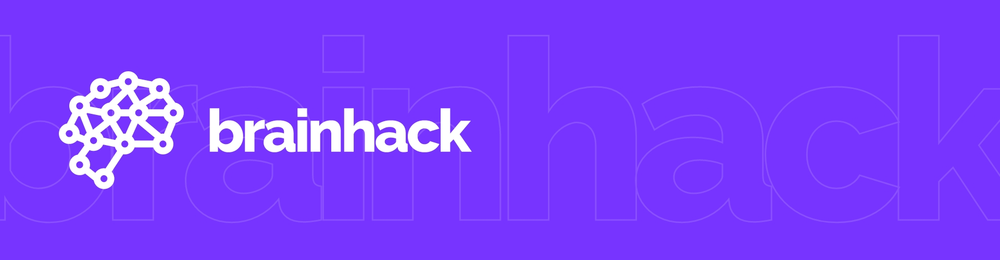

GitHub projekt pro reklamní kampaň **brainhack** z hodin MME a WEB v L4. V tomto projektu naleznete veškeré soubory webu a také výstupy reklam – ty naleznete ve složce `/ads`.

## Webová stránka

Demo webové stránky je dostupné na https://pslib-cz.github.io/2020l4web-campaign-Liturkey/. Pokud chcete webovou stránku spustit na svém počítači, není nic jednoduššího než si přes Git zklonovat projekt do svého počítače a spustit soubor `/index.html`.

Při úpravách je třeba myslet na to, že styly jsou vedené přes SCSS. Tudíž je potřeba pokaždé styl zkompilovat. K tomuto doporučuji použít [node-sass](https://github.com/sass/node-sass) balíček pro Node.js.

Projekt také obsahuje návrh designu webu. Ten naleznete v souboru `/navrh.xd`. Je třeba mít nainstalováno Adobe Xd. Bez programu Adobe Xd se lze na návrh podívat v souboru `/navrh.jpg`.

Tento repozítář je dostupný pod licencí Apache 2.0. Plné znění lze zobrazit v souboru `LICENSE`.